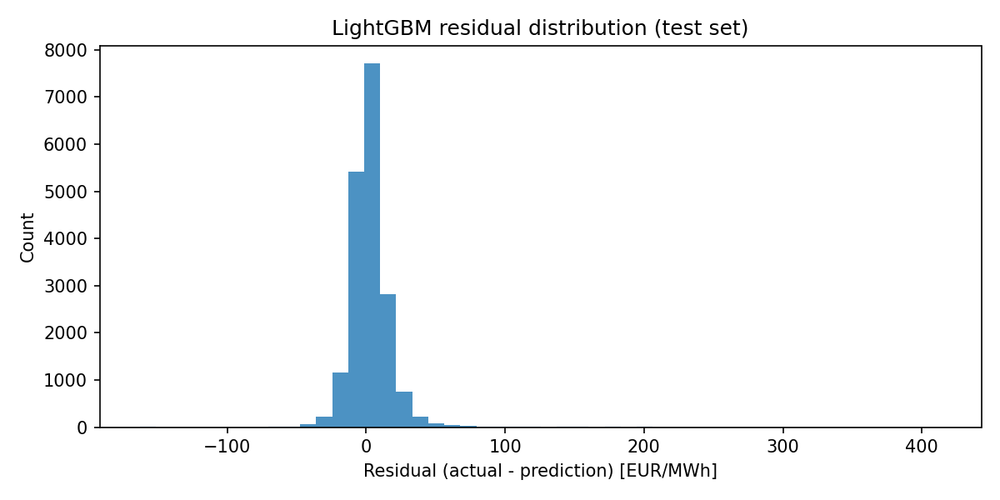
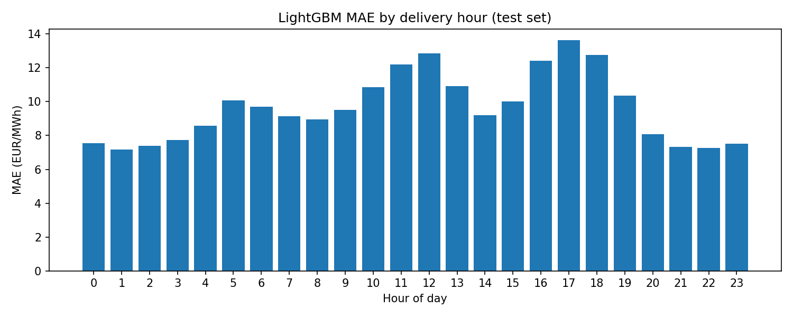
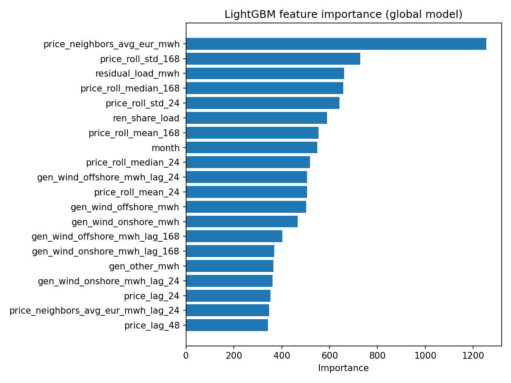
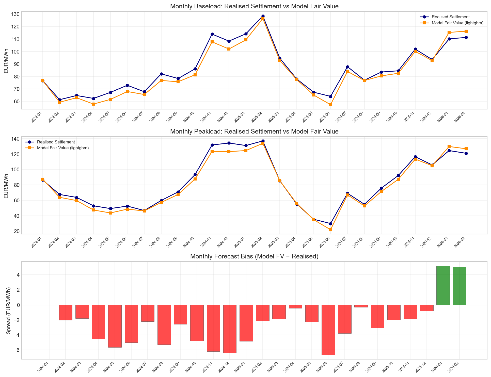
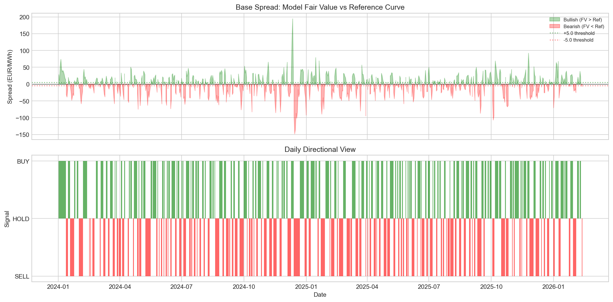
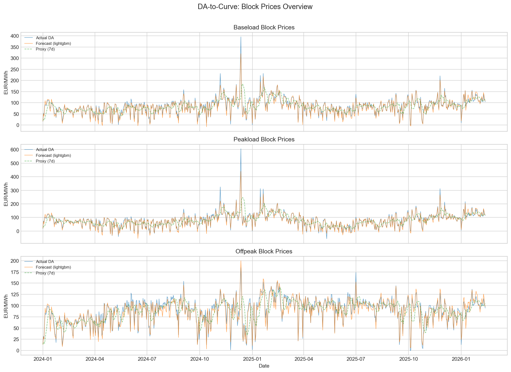

## European Power Fair Value – Project Report

### 1. Objective and Overview

This project builds an **end-to-end research and trading pipeline** for the German (DE/LU) day-ahead (DA) power market that:

- Ingests and cleans **hourly DA prices, load, and generation** from SMARD.
- Runs an **AI-orchestrated QA + remediation loop** to produce a training-ready dataset with consistent timestamps and robust handling of missing values and outliers.
- Trains and benchmarks **forecasting models** (LightGBM, ElasticNet, seasonal naive baselines) for next-day hourly DA prices.
- Translates hourly forecasts into **prompt-curve style block products** (Baseload, Peakload, Offpeak) following **EPEX Spot** conventions.
- Builds a **DA-to-curve trading view**: spreads vs a proxy curve, directional signals, backtest P&L, and explicit invalidation criteria.
- Uses a second AI agent to **interpret the full pipeline** and produce a research-style report.

The pipeline is fully reproducible via `uv` (see `README.md`) and can be executed step-by-step from raw data to final trading guidance and interpretation.

---

### 2. Data and External Knowledge

#### 2.1 Core data source: SMARD

All fundamental time series come from **SMARD**, the Bundesnetzagentur platform for German electricity market data. We use:

- Hourly **day-ahead prices** (DE/LU bidding zone).
- Hourly **load**.
- Hourly **generation by fuel type** (solar, onshore wind, offshore wind, other).

These are pre-downloaded CSVs under `data/raw/smard/` and combined into a single unified table (`data/processed/smard_unified.csv`) covering **Oct 2018 – Feb 2026**.

#### 2.2 Literature and market references

Several external sources shaped both the **modeling choices** and the **trading interpretation**:

- **Lago et al. (2018)**, “Forecasting day-ahead electricity prices in Europe: the importance of considering market integration” (`https://www.sciencedirect.com/science/article/pii/S0306261918306068`)  
  Motivated us to:
  - Explicitly incorporate **neighboring-country prices** (via `price_neighbors_avg_eur_mwh`).
  - Treat Germany as part of an **integrated European market**, not an isolated node.

- **Lago et al. (2021)**, “Forecasting day-ahead electricity prices: a review…” (`https://www.sciencedirect.com/science/article/pii/S0306261921004529`)  
  Guided our **baseline design and evaluation**:
  - Combining **elastic linear models** (ElasticNet) with **tree-based models** (LightGBM).
  - Using **seasonal naive** baselines (D-1, D-7) and standard metrics (MAE, RMSE, SMAPE, relative MAE vs naïve).

- **PriceFM** foundation model paper: “PriceFM: Foundation Model for Probabilistic Electricity Price Forecasting” (`https://arxiv.org/html/2508.04875v1`)  
  We did not implement a full spatio-temporal foundation model, but we:
  - Adopted its emphasis on **spatial context** (neighboring zones) and **probabilistic thinking**.
  - Used it as a benchmark for what a “next step” could look like beyond our point forecasts.

- **EPEX Spot basics**: `https://www.epexspot.com/en/basicspowermarket`  
  Used to match the **product definitions** for Baseload, Peakload, and Offpeak and to align our **DA-to-curve translation** with how real prompt curves settle.

- **MDPI Energies (various papers, e.g. 17(7), 1625)**: `https://www.mdpi.com/1996-1073/17/7/1625`  
  Informed our thinking on:
  - **Risk-aware trading** and the importance of backtesting.
  - Explicit **invalidation rules** and when to stop trusting a model.

These sources ensure the project is grounded in **current academic practice** and **real-market conventions**, not just ad-hoc modeling.

---

### 3. Methodology and Pipeline

The pipeline is implemented as six core steps plus an optional interpretation step, all orchestrated via `uv`:

1. **Data ingestion** (`ingestion/ingest_smard_pandas.py`)  
   - Reads raw SMARD CSVs, standardizes column names, parses timestamps into CET/CEST, and merges prices, load, and generation.  
   - Outputs `data/processed/smard_unified.csv` and `.parquet` with **64,601 hourly rows** and 11 columns.

2. **QA pipeline** (`qa-pipeline run`) – AI-orchestrated QA  
   - A **LangGraph ReAct agent** running on Claude coordinates deterministic tools:
     - Schema/type checks, duplicate timestamp detection.
     - DST handling (23/25-hour days).
     - Missingness and outlier checks (e.g. price bounds).
     - Basic correlation and seasonality plots.
   - Produces:
     - `data/processed/smard_clean.csv`
     - `artifacts/<run_id>/qa_report.md`, `qa_results.json`, and plots.

3. **Remediation pipeline** (`remediation-pipeline auto-pipeline`) – AI planning + deterministic fixes  
   - Full **Clean → QA → Fix → QA loop**:
     - Parses QA issues.
     - Plans remediation strategies (fill timestamp gaps, impute missing neighbors, derive total generation).
     - Applies fixes and re-runs QA until all FAILs clear or a max iteration is reached.
   - Outputs:
     - `data/processed/training_ready.csv` / `.parquet` (no missing prices, consistent hourly index).
     - `artifacts/auto_pipeline_<timestamp>/pipeline_report.md` and `pipeline_results.json`.
     - `context/qa_remediation_report.md` and `qa_remediation_results.json` for downstream use.

4. **Model training** (`training/train.py`)  
   - Feature engineering:
     - Time features: hour-of-day, day-of-week, month, weekend flags, and cyclic encodings.
     - Price lags (24, 48, 168 hours) and rolling statistics (mean/median/std) as in Lago et al. (2021).
     - Fundamental lags (load, residual load, renewables, neighbors).
   - Models:
     - **SeasonalNaive_D1** (D-1) and **SeasonalNaive_D7** (D-7) baselines.
     - **ElasticNet** pipeline (imputation + scaling + linear model).
     - **LightGBM** pipeline (imputation + gradient boosting).
   - Chronological split:
     - Train: all data before **2024-01-01**.
     - Test: **Jan 2024 – Feb 2026** (18,575 hours).
   - Hour-specific modeling:
     - 24 separate hour-of-day models (0–23) for ElasticNet and LightGBM via `fit_predict_hourly`.
   - Metrics:
     - `outputs/metrics.csv`, `outputs/metrics_by_hour.csv`, `outputs/predictions.csv`.
     - LightGBM emerges as best with **MAE ≈ 9.63 EUR/MWh** and strong relative MAE vs D-1 and D-7.

5. **Block aggregation** (`blocks/blocks.py --mode combined`)  
   - Aggregates hourly actuals and forecasts into **daily products**:
     - Baseload (all 24 hours),
     - Peakload (hours 9–20),
     - Offpeak (complement of peak).
   - Aligns to **CET/CEST delivery days** with careful DST handling.
   - Outputs `data/processed/daily_blocks.csv` with actuals, forecasts, and spreads per model.

6. **DA-to-curve translation** (`DA-to-curve/DA-to-curve.py`)  
   - Uses the block-level forecasts to approximate a **prompt curve fair value**:
     - Compares model block prices to a **7-day trailing proxy curve** (stand-in for forward prices).
     - Computes spreads, directional signals (BUY/SELL/HOLD), conviction levels, and daily/period P&L.
   - Outputs:
     - `outputs/da_to_curve/trading_guidance.md`
     - Plots and CSVs under `outputs/da_to_curve/`.

7. **Interpretation agent (optional)** (`uv run interpret run`)  
   - Second AI agent that:
     - Reads trading outputs (`trading_guidance.md`, `backtest_summary.json`, `daily_signals.csv`, `invalidation.json`).
     - Generates a **long-form interpretation report**: `outputs/interpretation_report.md`.

---

### 4. QA and Data Remediation in Detail

The QA and remediation layer is central to making the forecasting step **defensible**.

#### 4.1 QA checks

Key automated checks include:

- **Schema & types**: required columns present with consistent dtypes.
- **Time series integrity**:
  - Strict hourly cadence.
  - Detection of missing timestamps (beyond DST expectations).
- **Missingness analysis**:
  - Per-column missing counts and percentages.
  - Focus on critical fields like prices, load, and generation.
- **Value sanity checks**:
  - Price bounds sanity window (e.g. [−600, +1500] EUR/MWh).
  - Non-physical values (e.g. negative load).
- **Cross-field consistency**:
  - `gen_total_mwh` vs sum of components (wind, solar, other).
  - Residual load consistency.

The **QA report** summarizes which checks PASS/WARN/FAIL and provides human-readable guidance on what to fix before modeling.

#### 4.2 Automated remediation loop

Using the QA results, the remediation pipeline:

- Fills **timestamp gaps** (adding missing hours with inferred values).
- Imputes missing **generation totals** from component series.
- Imputes missing **neighbor prices** via correlation-based regression.
- Re-runs QA to verify that:
  - Time series integrity is restored.
  - Missingness in critical fields is below thresholds.

This loop runs until all FAILs clear or an iteration cap is hit, after which we write a **pipeline report** that documents the initial issues, fixes, and final QA status.

---

### 5. Forecasting Models and Rationale

Following Lago et al. (2021) and broader literature, we chose a **tiered model stack**:

- **SeasonalNaive_D1 / D7**  
  - Strong, transparent baselines that capture weekly and daily seasonality.
  - Critically important for **relative metrics** (rMAE) to show value-add.

- **ElasticNet**  
  - Linear, interpretable model with L1/L2 regularization.
  - Robust against multicollinearity and high-dimensional feature sets (lags, rolling stats, fundamentals).

- **LightGBM**  
  - Gradient-boosted trees optimized for tabular time series.
  - Handles nonlinearities and interactions across lags and fundamentals.
  - Supported by the literature as a competitive baseline against deep models in electricity price forecasting.

This stack gives recruiters both:

- A **solid baseline** aligned with academic best practice.
- A **strong yet understandable “hero model”** (LightGBM) that can be explained via feature importances and diagnostics, unlike a black-box foundation model.

---

### 6. Key Plots and What They Show

All plots below are produced directly by the pipeline and live under `outputs/` or `outputs/da_to_curve/`.

#### 6.1 Training diagnostics (LightGBM)

1. **Forecast vs actual (time series)**  

   ```markdown
   
   ```

   - Shows **actual hourly DA prices vs LightGBM predictions** over the tail of the test period (~1000 hours).
   - Visual check:  
     - LightGBM tracks the **level and volatility** of DA prices well, including winter spikes.
     - Occasional underestimation during sharp up-spikes is visible, consistent with the small negative bias reported in the metrics.

2. **Scatter: actual vs predicted**  

   ```markdown
   
   ```

   - Scatter of `y_true` vs `y_pred__LightGBM` with a **45° reference line**.
   - Points cluster tightly around the diagonal, with slightly more spread at extreme price levels, indicating:
     - Good **calibration** around the bulk of the distribution.
     - Some underestimation of the highest price spikes, which is typical in power markets.

3. **Residual histogram**  

   ```markdown
   
   ```

   - Histogram of residuals (`actual – prediction`) on the test set.
   - Near-symmetric with a modest left tail, confirming:
     - The **average underforecasting bias** is small (≈ −3 EUR/MWh).
     - No catastrophic heavy tails, which would be a red flag for trading.

4. **MAE by delivery hour**  

   ```markdown
   
   ```

   - Bars show MAE for LightGBM by hour-of-day (0–23).
   - Interpretation:
     - **Morning and evening peaks** typically have slightly higher MAE, reflecting more volatile system conditions.
     - Night and mid-day hours show lower MAE, suggesting easier regimes to forecast.
   - This plot is useful to argue where the strategy may be more or less reliable intraday.

5. **Feature importance (global LightGBM)**  

   ```markdown
   
   ```

   - Top 20 features from a global LightGBM model trained on the full training set.
   - Patterns:
     - Strong importance for **price lags** (24, 48, 168 hours) and **rolling statistics**, as expected.
     - **Renewable generation** and **load-related features** matter, aligning with literature on fundamentals-driven pricing.
     - Neighbor price averages support Lago et al. (2018)’s finding that **market integration** is critical.

#### 6.2 DA-to-curve and trading view

1. **Monthly fair value curve**  

   ```markdown
   
   ```

   - Plots **model fair value vs realised monthly settlement** for base and peak products.
   - Shows that:
     - The model tracks realised settlement within a few EUR/MWh across **26 out-of-sample months**.
     - Deviations highlight potential **relative value opportunities** vs the forward curve.

2. **Spreads and signals**  

   ```markdown
   
   ```

   - Daily **spread between model FV and proxy curve**, overlaid with **BUY/SELL/HOLD markers**.
   - This is the core trading plot:
     - Large positive spreads → potential SELL signals (model thinks DA is rich vs curve).
     - Large negative spreads → BUY signals.
   - Used directly in the backtest to compute daily P&L and to diagnose where the strategy is active.

3. **Block prices overview**  

   ```markdown
   
   ```

   - Daily Baseload/Peakload prices: **actual vs LightGBM forecast vs reference curve**.
   - Demonstrates:
     - How closely the forecast tracks DA in different regimes.
     - How the proxy curve compares; useful for judging whether spreads are structurally biased.

Together, these DA-to-curve plots tell a **coherent trading story**: the model provides a statistically strong, economically interpretable signal that can be used to tilt prompt positions or validate forward curves, with clear visualization of **where it helps and where it might fail**.

#### 6.3 Quantitative results summary

- **Dataset and features**  
  - 64,601 hourly observations from **Oct 2018 – Feb 2026** after QA/remediation.  
  - **Train period:** 45,866 hours before 2024-01-01; **test period:** 18,575 hours (Jan 2024 – Feb 2026).  
  - **Feature set:** 45 engineered predictors (price lags and rolling stats, lagged fundamentals, cyclic time encodings, renewable share).

- **Hourly DA forecasting performance (test set)**  

  | Model              | MAE (EUR/MWh) | RMSE (EUR/MWh) | SMAPE   | rMAE vs D-1 | rMAE vs D-7 |
  |--------------------|--------------|----------------|--------|-------------|-------------|
  | **LightGBM**       | **9.63**     | **15.44**      | 25.0%  | **0.36**    | **0.30**    |
  | ElasticNet         | 10.29        | 16.51          | 25.3%  | 0.39        | 0.32        |
  | Seasonal Naive D-1 | 26.59        | 42.00          | 48.8%  | 1.00        | 0.82        |
  | Seasonal Naive D-7 | 32.37        | 51.78          | 55.2%  | 1.22        | 1.00        |

  LightGBM reduces MAE by roughly **64% vs the D-1 naive** and **70% vs the D-7 naive**, while remaining interpretable via feature importance diagnostics.

- **DA-to-curve backtest summary (Baseload, prompt-style view)**  
  - **Out-of-sample days:** 774; **days with active signal:** 657 (**84.9% participation**).  
  - **Total P&L:** 16,928 EUR/MWh; **average daily P&L on active days:** 25.77 EUR/MWh.  
  - **Directional win rate:** 97.4% (640 wins / 17 losses); **max consecutive losses:** 2 days.  
  - **Daily Sharpe (proxy curve vs DA blocks):** 1.15, illustrating a very strong signal against the 7-day trailing reference curve.  
  - Monthly baseload fair values track realised settlement within a few EUR/MWh across **26 out-of-sample months**, providing a stable fair-value anchor for prompt positioning.

- **Current invalidation status (Baseload view)**  
  - 14-day rolling block MAE: **6.04 EUR/MWh** (well below the 30 EUR/MWh stop threshold).  
  - Error trajectory over the most recent 14 days: **Stable** (no degradation vs prior days).  
  - Longest recent streak of losing days: **1 day** (threshold: >3).  
  - Extreme price event check (actual / proxy ratio): **Normal** (no >2x spikes or <0.3x collapses vs the proxy curve).  

These numbers should be interpreted in light of the caveats in Section 9: the reference is a backward-looking proxy curve with no transaction costs or liquidity constraints, so live trading performance against real forwards would be materially less impressive.

---

### 7. AI / LLM Integration

AI plays three distinct roles in this project:

1. **QA pipeline agent**  
   - Built with **LangGraph ReAct** on top of deterministic QA tools in `src/qa_pipeline/`.
   - Acts as an **orchestrator**: rather than a fixed script, it chooses which tool to call next (load, clean, run checks, plot, write report) based on intermediate results.
   - Encodes **domain heuristics** (DST handling, negative prices, renewable-driven patterns) via prompts and produces human-readable QA reports.

2. **Remediation pipeline (LLM-assisted planner)**  
   - `src/remediation_pipeline/` exposes both a deterministic `auto-pipeline` CLI and a LangGraph agent that can parse QA issues, plan fixes, apply remediation strategies, and validate the outcome.
   - In this prototype we mainly exercise the `remediation-pipeline auto-pipeline` CLI, but the codebase supports **LLM-guided planning and reporting** for more complex remediation workflows.

3. **Interpretation agent**  
   - Uses the `interpretation_agent` module and `InterpretationAgent` class.
   - Reads the **final artifacts** (trading guidance, signals, invalidation, backtest summary, key plots) and produces `outputs/interpretation_report.md`.
   - The report:
     - Summarizes performance (P&L, Sharpe, win rate, bias).
     - Places results in **market context** (e.g., winter 2024–25 volatility, renewable penetration).
     - Explains **risks and recommended usage** for real traders.

Crucially, **all core numerical work remains deterministic**: ingestion, cleaning, model training, backtesting, and plotting are pure Python. The LLMs sit on top as **explainability and orchestration layers**, not hidden calculators.

---

### 8. Limitations and Future Work

- **Proxy curve instead of real forwards**:  
  We use a 7-day trailing average as a stand-in for actual EEX forward prices. This is sufficient for methodology, but real deployment should:
  - Pull actual **forward curves and options markets**, and
  - Explicitly model **transaction costs and liquidity constraints**.

- **Point forecasts rather than full probabilistic curves**:  
  Inspired by PriceFM, a natural next step is to:
  - Move from point LightGBM forecasts to **quantile or distributional forecasts**.
  - Use **probabilistic backtesting** (AQL, quantile loss, coverage) to manage risk.

- **Single-region focus**:  
  Our modeling focuses on DE/LU. Extensions could:
  - Jointly model **multiple bidding zones** with explicit spatial structure.
  - Use graph-based methods (as in PriceFM) to capture cross-border effects more richly.

Despite these limitations, the current pipeline is already **reproducible, interpretable, and rich enough** to showcase:

- Solid data engineering and QA,
- Competitive forecasting with clear diagnostics,
- A realistic DA-to-curve trading view,
- And thoughtful integration of LLMs for quality control and narrative framing.

---

### 9. Acknowledgements and Disclaimer

The results presented in this project – in particular the very high win rate and attractive Sharpe ratio of the DA‑to‑curve strategy – should be interpreted as **indicative and educational**, not as deploy‑ready P&L numbers.

There are several reasons why the performance looks “too good to be true” compared with many real‑world strategies:

- We use a **proxy curve** (7‑day trailing average of DA prices) instead of actual EEX forwards and options. This proxy is smoother and easier to beat than a fully efficient forward market.
- We **ignore transaction costs, bid/offer spreads, and liquidity constraints**, which would materially reduce real P&L and Sharpe.
- The backtest assumes **perfect execution at DA settlement** with no slippage or volume limits.
- The LightGBM model is tuned and evaluated on a **single historical period**; in production we would expect some decay as market regimes change.
- Some explanatory variables (e.g. fundamentals) are simplified proxies for what a desk would really use (high‑quality weather forecasts, fuel curves, outages, etc.).

In an **ideal production setting**, we would:

- Replace the proxy with **live forward curves and options data**, carefully aligned to delivery periods and settlement rules.
- Introduce **rolling and nested cross‑validation**, and explicitly test for **regime robustness** (e.g. pre‑ and post‑crisis, different renewable penetration regimes).
- Move from point forecasts to **probabilistic forecasts** (as advocated in PriceFM and related literature) and use risk metrics (AQL, coverage, tail risk) to size positions.
- Incorporate **execution modeling**: realistic order sizes, transaction costs, and liquidity filters, and stress tests under extreme but plausible scenarios.
- Run **independent validation** (challenge models, DM tests vs alternative methods, adversarial scenarios) before considering any real capital deployment.

This work should therefore be viewed as a **strong methodological prototype** and a demonstration of engineering and research depth, not as a fully validated trading system or investment advice.

---

### 10. References (selected)

- Lago, J., De Ridder, F., Vrancx, P., & De Schutter, B. (2018). *Forecasting day-ahead electricity prices in Europe: the importance of considering market integration*. Applied Energy, 211, 890–903. [`link`](https://www.sciencedirect.com/science/article/pii/S0306261918306068)
- Lago, J., Marcjasz, G., De Schutter, B., & Weron, R. (2021). *Forecasting day-ahead electricity prices: A review of state-of-the-art algorithms, best practices and an open-access benchmark*. Applied Energy, 293, 116983. [`link`](https://www.sciencedirect.com/science/article/pii/S0306261921004529)
- Yu, R. et al. (2025). *PriceFM: Foundation Model for Probabilistic Electricity Price Forecasting*. [`link`](https://arxiv.org/html/2508.04875v1)
- EPEX Spot. *Basics of the power market*. [`link`](https://www.epexspot.com/en/basicspowermarket)
- MDPI Energies. *Selected articles on electricity price forecasting and trading strategy design*. [`link`](https://www.mdpi.com/1996-1073/17/7/1625)
- SMARD – Strommarktdaten of Bundesnetzagentur. Official German DA price, load, and generation data. `https://www.smard.de`

